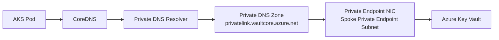

# Private Networking Architecture Assessment

## 1. Scope

This document describes the private connectivity pattern implemented for platform services, with specific focus on Azure Key Vault access from AKS workloads over private networking components.

Covered capabilities:

- Azure Private Link and Private Endpoints
- Azure Private DNS Zones and virtual network links
- Key Vault private connectivity controls
- End-to-end DNS resolution and data path from AKS pods

## 2. Azure Private Link

Azure Private Link provides private access from a virtual network to Azure PaaS services by exposing service endpoints through private IP addresses. In this implementation, Private Link is used to keep Key Vault traffic on private network paths and remove dependency on public endpoints.

Implementation characteristics:

- service connectivity is anchored to private endpoint NICs in dedicated subnets
- traffic remains inside peered hub-spoke virtual networks
- public network access is disabled for Key Vault

## 3. Azure Private Endpoint

An Azure Private Endpoint is deployed for Key Vault into the spoke private endpoint subnet.

Implementation characteristics:

- private endpoint is created in the supplied subnet ID
- endpoint targets the Key Vault `vault` subresource
- private endpoint is associated with an existing private DNS zone group

Operational effect:

- workload traffic to Key Vault resolves to a private IP
- traffic is routed to the endpoint NIC inside the VNet address space

## 4. Azure Private DNS Zones

The private DNS module creates and manages the following zones:

- `privatelink.vaultcore.azure.net`
- `privatelink.blob.core.windows.net`
- `privatelink.azurecr.io`

Zone linking model:

- every zone is linked to all supplied VNets
- current usage links both hub and spoke VNets
- registration is disabled on links

This allows workloads in linked VNets to resolve private endpoint FQDNs through Azure private DNS records.

## 5. Key Vault Private Connectivity

The Key Vault deployment enforces private-only access posture:

- RBAC authorization enabled
- soft delete retention enabled
- purge protection enabled
- public network access disabled
- network ACL default action deny

Private access path:

- Key Vault private endpoint deployed in spoke private endpoint subnet
- private DNS zone integration via `privatelink.vaultcore.azure.net`
- DNS resolution returns private endpoint IP instead of public service IP

## 6. DNS Resolution and Request Flow

The implemented target request path is:

`Pod -> CoreDNS -> Private DNS Resolver -> Private DNS Zone -> Private Endpoint -> Key Vault`

Detailed sequence:

1. Pod initiates connection to the Key Vault FQDN.
2. CoreDNS receives the DNS query from the pod inside the AKS cluster.
3. Query is forwarded to private DNS resolution components in the hub model.
4. Private DNS zone `privatelink.vaultcore.azure.net` returns the private endpoint record.
5. Pod connects to the returned private IP in the private endpoint subnet.
6. Traffic reaches Key Vault over Private Link.

## 7. Logical Component View

## 8. Security and Control Posture

Private connectivity design controls implemented:

- elimination of public Key Vault data-plane exposure
- private DNS based service discovery for PaaS private endpoints
- subnet-level segmentation between AKS nodes and private endpoints
- NSG and route table boundaries applied to spoke subnets

These controls support workload-to-service communication through private, policy-controlled network paths.

